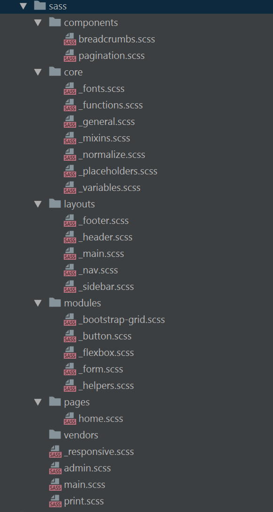

# Слова, часто используемые в CSS-классах

## Изображения

`image`, `img`, `picture`, `pic` — картинка

`icon` — иконка

`logo` — логотип

`userpic`, `avatar` — юзерпик, маленькая картинка пользователя

`thumbnail`, `thumb` — миниатюра, уменьшенное изображение

## Текст

`title`, `subject`, `heading`, `headline`, `caption` — заголовок

`subtitle` — подзаголовок

`slogan` — слоган

`lead`, `tagline` — лид-абзац в тексте

`text` — текстовый контент

`desc` — описание, вариант текстового контента

`excerpt` — отрывок текста, обычно используется перед ссылкой «Читать далее...»

`quote`, `blockquote` — цитата

`snippet` — пример кода

`link` — ссылка

`copyright`, `copy` — копирайт

## Списки

`list`, `items` — список

`item` — элемент списка

## Блоки

`page` — корневой элемент страницы

`header` — шапка (страницы или элемента)

`footer` — подвал (страницы или элемента)

`section` — раздел контента (один из нескольких)

`main`, `body` — основная часть (страницы или элемента)

`content` — содержимое элемента

`sidebar` — боковая колонка (страницы или элемента)

`aside` — блок с дополнительной информацией

`widget` — виджет, например, в боковой колонке

## Раскладка

`wrapper`, `wrap` — обёртка, обычно внешняя

`inner` — внутренняя обёртка

`container`, `holder`, `box` — контейнер

`grid` — раскладка (страницы или элемента) в виде сетки (обычно содержит в себе `row` и `col`)

`row` — контейнер в виде строки

`col`, `column` — контейнер в виде столбца

## Элементы управления

`btn`, `button`,  —  кнопка, например, для отправки формы

`control` — элемент управления, например, стрелки «Вперёд/назад» в фотогалерее, кнопки управления слайдером

`dropdown` — выпадающий список

## Медиавыражения

`phone`, `mobile` — мобильные устройства

`phablet` — телефоны с большим экраном (6-7")

`tablet` — планшеты

`notebook`, `laptop` — ноутбуки

`desktop` — настольные компьютеры

## Размеры

`tiny` — маленький, крохотный

`small` — небольшой

`medium` — средний

`big`, `large` — большой

`huge` — огромный

`narrow` — узкий

`wide` — широкий

## Разное

`search` — поиск

`socials` — блок иконок соцсетей

`advertisement`, `adv`, `commercial`, `promo` — рекламный блок (режутся Адблоком, не рекомендуется использовать такие классы для блоков с внутренней рекламой)

`features`, `benefits` — список основных особенностей товара, услуги

`slider`, `carousel` — слайдер, интерактивный элемент с прокруткой содержимого

`pagination` — постраничная навигация

`user`, `author` — пользователь, автор записи или комментария

`meta` — блок с дополнительной информацией, например, блок тегов и даты в посте

`cart`, `basket` — корзина

`breadcrumbs` — навигационная цепочка, «хлебные крошки»

`more`, `all` — ссылка на полную информацию

`modal` — модальное (диалоговое) окно

`popup` — всплывающее окно

`tooltip`, `tip` — всплывающее подсказки

`preview` — анонс, отрывок, например новости или поста, может состоять из заголовка, описания и картинки. Предполагается ссылка на полную версию

## Состояния

`active`, `current` — активный элемент, например, текущий пункт меню

`hidden` — скрытый элемент

`error` — статус ошибки

`warning` — статус предупреждения

`success` — статус успешного выполнения задачи

`pending` — состояние ожидания, например, перед сменой статуса на error или success

## Примеры использования

### Галерея

```html
<div class="gallery">
  <ul class="gallery__list">
    <li class="gallery__item">
      
    </li>
    <li class="gallery__item">
      
    </li>
  </ul>
</div>
```

```scss
.gallery {
    &__list {}
    &__item {}
    &__image {}
}
```

### Блок новостей

```html
<div class="news">
    <h3 class="news__title">Вчерашние новости</h3>

    <ul class="news__list">
        <!-- к классу элемента добавляем класс блока,
             чтобы создать новое пространство имён -->
        <li class="news__item item-news">
            <h4 class="item-news__title">Соревнования среди воблы по конькобежному спорту</h4>
            <div class="item-news__text">
              <p>Победила команда килек из Петрозаводска</p>

              <a href="#" class="item-news__link">Читать дальше</a>
            </div>
        </li>

        <li class="news__item news__item--red item-news">
            <h4 class="item-news__title">Учёные уточнили роль напильника в уходе за ногтями</h4>
            <div class="item-news__text">
              <p>Британские учёные высоко оценили вклад
                напильника в отращивание полутораметровых ногтей.</p>

              <a href="#" class="item-news__link">Не читать дальше</a>
            </div>
        </li>
    </ul>
</div>
```

```scss
.news {
    &__title {}
    &__list {}
    &__item {
        // Модификатор
        &--red {}
    }
}

.item-news {
    &__title {}
    &__text {}
    &__link {}
}
```

### Статья или пост в блоге (простой вариант)

```html
<article class="article">
  <h3 class="article__title">Нащупываем чакры у пучка петрушки</h3>
  <time class="article__datetime">32 мая, 10:87</time>

  <div class="article__author author-article">
    
    <a class="author-article__link" href="#">Клешня Андреевна Долгорукая</a>
    <div class="author-article__desc">Наш эксперт по чакрам</div>
  </div>

  <div class="article__content">
    Сходите на рынок и купите у старушек пучок петрушки грамм на 100.
    Как следует переберите, очистите от жуков и гусениц. Жуков отдайте поиграться
    коту, гусениц поселите в горшок с кактусами, пусть одна будет Джоном,
    вторая Билли, а у вас в горшке теперь будет Дикий Запад. Вернитесь
    к пучку петрушки. Ласково взгляните на него и как следует почешите
    за ухом, можно себе или коту. Перевяжите атласной ленточкой,
    непременно завяжите бант. Поздравляем! Теперь у вас есть полностью
    одомашненный пучок петрушки, который будет весело бегать за вами
    по пятам и проращивать свои семена в ваших тапках.
  </div>
</article>
```

```scss
.article {
    &__title {}
    &__datetime {}
    &__author {}
    &__content {}
}

.author-article {
    &__img {}
    &__link {}
    &__desc {}
}
```

# Медиазапросы
* Медиазапросы должны быть размещены в конце файла.
* Запрещено размещать медиазапросы в теле кода основного файла!
* Медиазапросы не должны содержать дублирования основного кода - только измененные свойства.
* В 99% случаев необходимо использовать стандартные медиа просто скопировав их целиком в конец файла, неиспользуемые свойства нужно оставить пустыми.
* Только в крайних случаях можно добавить дополнительный медиа.
* Для удобства этот шаблон находится в файле *_responsive.scss*.

```scss
///////////////////////RESPONSIVE//////////////////////////
@media screen and (max-width: 1400px) {
}

@media screen and (max-width: 1200px) {
}

@media screen and (max-width: 992px) {
}

@media screen and (max-width: 768px) {
}

@media screen and (max-width: 576px) {
}
```

# Sass структура

* *core* - базовые стили (reset, переменные, вспомогательные функции, миксины, нестандартные шрифты).
* *layouts* - стили для основных блоков сайта.
* *components* - стили для конкретных компонентов используемых на сайте (небольшие переиспользуемые блоки).
* *modules* - полезные наборы стилей для повторного использования.
* *pages* - под каждую страницу создается отдельный файл, который содержит стили только для конкретной страницы. 
* *vendors* - файлы сторонних библиотек (fontawesome, slick-slider).
* *main.scss* - главный файл, в котором происходит подключение остальных файлов для fronted части сайта.
* *admin.scss* - файл содержащий стили для backend части сайта (admin panel).
* *print.scss* - стили при исползовании функционала печати страницы сайта, в нем указываем стили что скрыть, а что оставить при печати.


