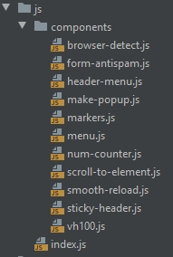

# JS структура


* *index.js* - основной файл, должен содержать импорт необходимых компонентов, их инициализацию, простой код для инициализации библиотеки `$('select').niceSelect();`. Остальное помещаем в компоненты
* *components* - содержит компоненты для повторного исползования, с возможносью изменять поведение в зависимости от переденных значений аргументов.

**Осмысленные названия файлов, функций, переменных, code style в одном стиле!!!**

`const` - используем если переменная не изменится

`let` - используем если переменная изменится в процессе выполнения скрипта

### Пример компонента
```js
/**
 * Sticky Header
 *
 * @param {Object} [options]
 *
 * @returns {void}
 */
const stickyHeader = (options) => {
    const defaults = {
        header: '.js-header',
        activeClass: 'is-sticky',
    };

    const settings = $.extend({}, defaults, options);

    const $w = $(window);
    const $header = $(settings.header);

    const offset = $header.outherHeight();     

    let hasClass = false, scrollTop = $w.scrollTop();

    if (scrollTop > offset) {
        $header.addClass(settings.activeClass);
    }

    $w.on('scroll', function () {
        scrollTop = $w.scrollTop();
        hasClass = $header.hasClass(settings.activeClass);

        if (scrollTop > offset && !hasClass) {
            $header.addClass(settings.activeClass);
        } else if (scrollTop < offset && hasClass) {
            $header.removeClass(settings.activeClass);
        }
    });
};

export default stickyHeader;
```

### Импорт и Инициализация компонента
```js
import stickyHeader from './components/stickyHeader';

$(function() {
     stickyHeader({
         header: '.header',
         activeClass: 'sticky',    
     });
});
```
