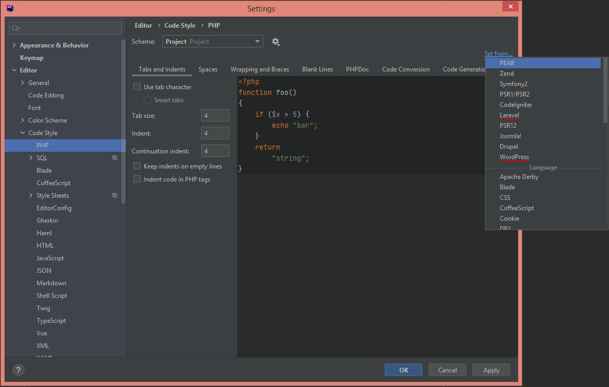
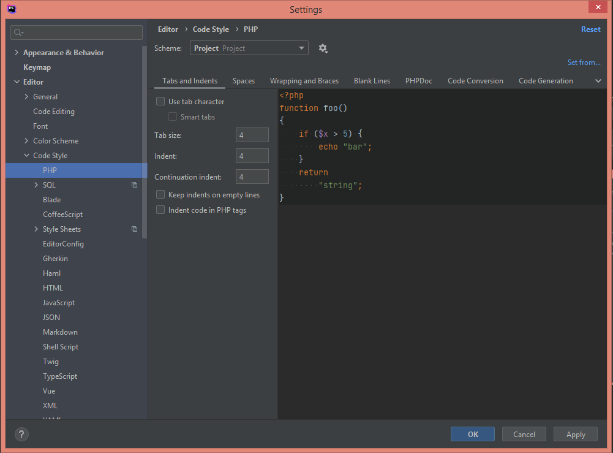

# PHP

## Безопасность
+ Валидация (validation) и санация (sanitization) вводимых данных. На стороне frontend и backend
+ Подготовка и очистка прямых SQL запросов
+ Экранирование (escape) или валидация (validate) вывода
+ Nonce - являются инструментов для борьбы с CSRF — межсайтовая подделка запроса ([example JS](https://github.com/dudka-agency/build-wp/blob/master/wp-content/themes/classy/assets/js/examples/wp-ajax.js#L7), [example PHP](https://github.com/dudka-agency/build-wp/blob/master/wp-content/themes/classy/app/custom/ajax/theme_ajax.php#L3))
+ Избегайте Heredoc и Nowdoc - делает невозможным применение практики позднего экранирования (late escaping)
+ Обновление зависимостей (composer.json, package.json)
+ Хеширование паролей
+ Сильные пароли (цифры, верхний и нижний регистр, специальные символы), длина > 10
+ Использование SSH, SFTP вместо FTP

### Code Style
```
File -> Settings... -> Editor -> Code Style -> PHP
```


+ Стиль подходящий под проект, это относится и к названиям функций и переменных.
+ Комментирование написанного кода, соблюдение отступов, группировка кода для определенных задач.
+ Избегать глубокой вложенности, разбивать код на куски, а не все в одном методе. 
+ Придерживаться принципа DRY.
+ Делать отступы между кодом, что бы все не смотрелось кашей

```php
<?php
/**
 * Global post ID (wordpress)
 * 
 * @param int $post_id
 * @return int
 */
function get_global_id($post_id) {
    return wpml_object_id_filter($post_id, 'post', true, ICL_LANGUAGE_CODE);
}

// vs

/**
 * Global post ID (laravel)
 * 
 * @param int $postId
 * @return int
 */
function getGlobalId($postId) {
    return wpmlObjectIdFilter($postId, 'post', true, ICL_LANGUAGE_CODE);
}
```

Ограничить длину строки. Читабельный код.

```php
$email->set_from('test@email.com')->add_to('programming@gmail.com')->set_subject('Methods Chained')->set_body('Some long message')->send();
 
// good
$email
    ->set_from('test@email.com')
    ->add_to('programming@gmail.com')
    ->set_subject('Methods Chained')
    ->set_body('Some long message')
    ->send();
```

Форматирование кода: `Code -> Reformat Code`

#### Tabs and Indents


### Рекомендации
+ Включить debug, проверять нет ли в коде ошибок, отключить для продакшена
+ Делать проверки на существование ключа в массиве, переменной, типа  
